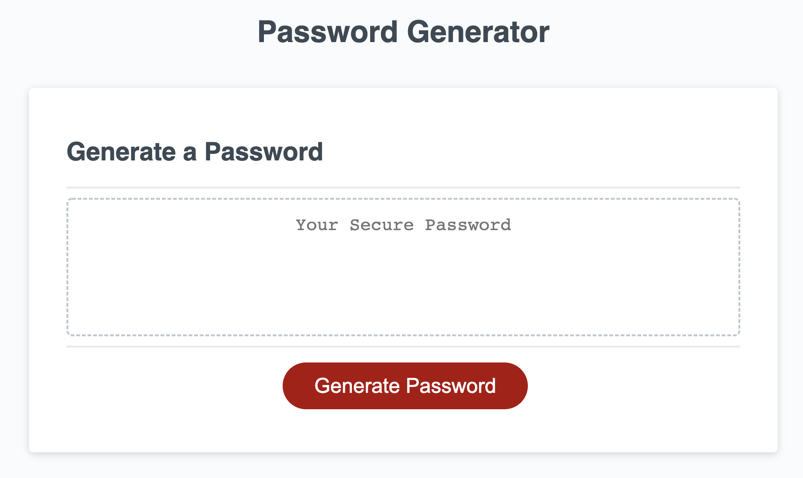
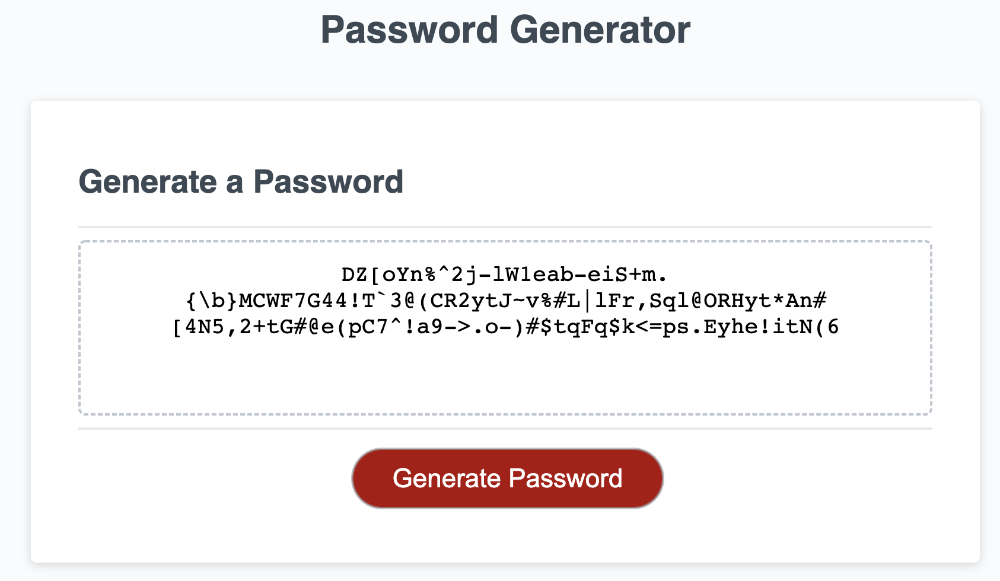

# Password Generator 

## Description

A user is able to click a button to generate a password that meets user specified criteria. The password must be between 8 and 128 characters. If the user types in a number that goes outside of those parameters they are given a alert and allowed to choose again what length they want the password. The user is then able to confirm if they would like the password to include lower case letters, upper case letters, numbers and/or special characters. If the user does not either letters or numbers then the system will automatically put special characters in the password.

## Screenshots of the Password Generator 

### Link to the Deployed Website 

